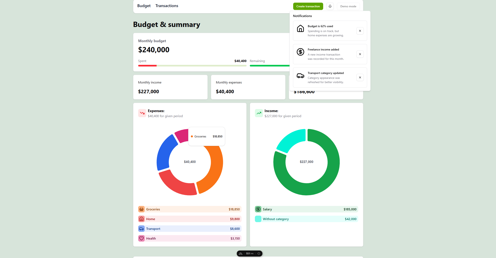

# Nuxt Expenses

A sleek expense tracking application for personal finance management.

## Screenshots



## Highlights

- Expense tracking with categories
- Income management
- Financial dashboard with charts
- User authentication
- Responsive design

## Stack

- Nuxt.js 3
- Vue 3
- TypeScript
- pnpm
- Turso (LibSQL)
- Better Auth
- Drizzle ORM
- Tailwind CSS
- Shadcn Vue
- Chart.js

## Run

```bash
pnpm install
pnpm db:push
pnpm dev
```

Open `http://localhost:3000`.

## Environment

```env
TURSO_DATABASE_URL=
TURSO_AUTH_TOKEN=
BETTER_AUTH_SECRET=
```